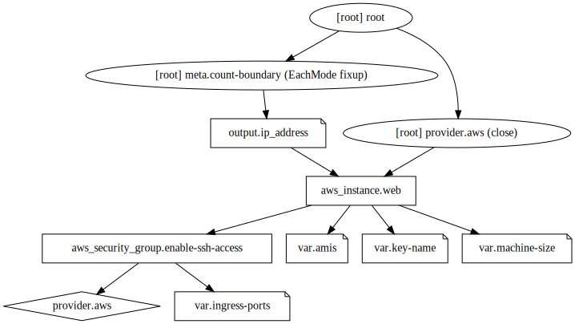

# Terraform

For this challenge, I decided to use AWS.

The terraform code present in this repository creates ec2 and security group instances, releasing three ports:
- 22 
- 80
- 8080

# IAM

To provision machines on AWS using terraform, it is necessary to create IAM credentials and export them to where the terraform will be executed.

In this example we will use environment variables:

```
export AWS_ACCESS_KEY_ID= $YOUR_AWS_KEY
export AWS_SECRET_ACCESS_KEY= $YOUR_AWS_ACCESS
```

## Execute the terraform code

Inside the terraform directory type:
## Step 1:
```
terraform init 
```
Terraform will download the dependencies for the selected provider. In this case, AWS

## Step 2:
```
terraform plan
```
This command generates the terraform plan that will be built on AWS

## Step 3:
```
terraform apply
```
Terraform will present a message for you to type yes or no. 

Confirm by typing **yes**

Wait for a while and the machine's public ip will be displayed shortly thereafte


## Show-me the code!

### Youtube video

[](http://www.youtube.com/watch?v=J5fV_IC7TnU "Terraform application")


### Terraform graph for the challenge 


